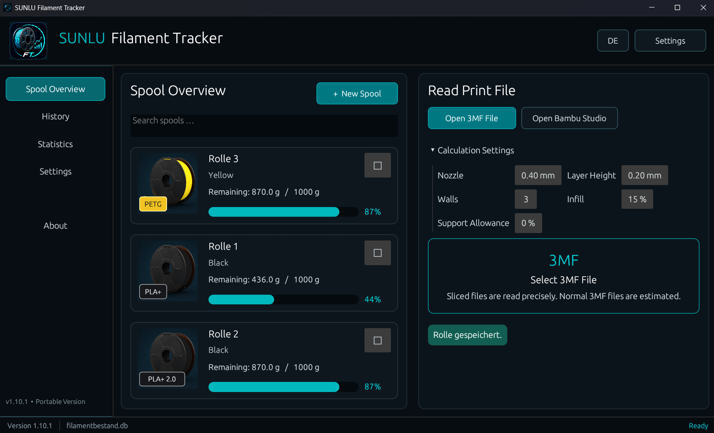
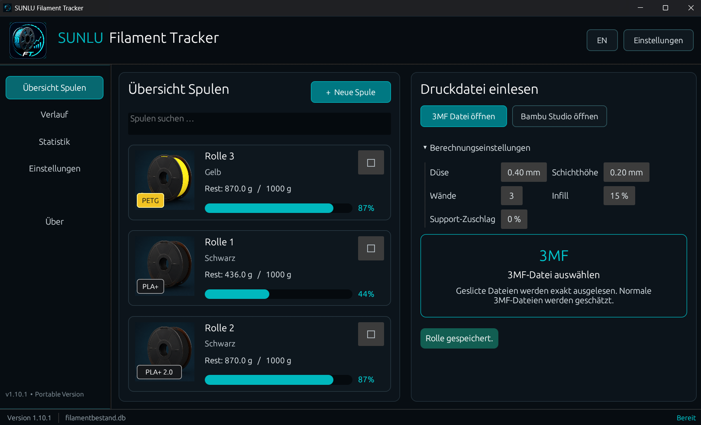

# SUNLU Filament Tracker

<p align="center">
  
</p>

<p align="center">
  <strong>Portable Windows application for managing filament spools, remaining stock, print history, AMS assignments, and 3MF consumption.</strong><br>
  <strong>Portable Windows-Anwendung zur Verwaltung von Filamentrollen, Restbeständen, Druckhistorie, AMS-Zuordnungen und 3MF-Verbrauchsdaten.</strong>
</p>

<p align="center">
  <a href="#english">English</a> · <a href="#deutsch">Deutsch</a> ·
  <a href="CHANGELOG.md">Changelog</a> · <a href="RELEASE_NOTES.md">Release notes</a> ·
  <a href="LICENSE">License</a>
</p>

<p align="center">
  
  
  
  
</p>

> **Freeware · Copyright © 2026 Ralf Ebert · All rights reserved.**  
> Independent utility — not an official SUNLU or Bambu Lab product.

## Screenshots / Bildschirmfotos

| English | Deutsch |
|---|---|
|  |  |

---

<a id="english"></a>

# English

## Purpose of the program

**SUNLU Filament Tracker 1.10.1** is a portable Windows application for managing filament spools, remaining stock, print history, AMS assignments, and filament consumption from 3MF files.

The application is designed for users who want to keep a clear overview of available filament, record print consumption, assign spools to AMS units and slots, and maintain a traceable print history without requiring separate database software.

> This is an independent freeware project. It is not affiliated with SUNLU, Bambu Lab, or their official projects. Product and company names are used only to describe compatibility.

## Main functions

- Manage spools by name, manufacturer, material, color, initial weight, remaining weight, empty-spool weight, price, storage location, and notes
- Display remaining filament in grams and percent
- Assign spools to an AMS unit and slot
- Read standard `.3mf` files and sliced `.gcode.3mf` files
- Estimate filament consumption from model geometry and print settings
- Use stored slicer values whenever available
- Record successful, failed, partially consumed, non-deducted, or manually entered prints
- Maintain a print history with CSV export
- Use an integrated SQLite database without separate database software
- Create and restore database backups
- Automatically retain up to ten backups
- Switch between German and English
- Use a permanent dark interface
- Run as a portable Windows application without an installer

## Filament calculation

Sliced `.gcode.3mf` files are evaluated using stored slicer values whenever they are available.

For normal 3MF files, the application estimates consumption from model geometry, nozzle diameter, layer height, wall count, infill, support allowance, and material density. This estimate does not replace a complete slicer calculation. Purge material, complex support structures, and multicolor changes can only be calculated reliably from a sliced file.

## Data and backups

The application stores its data in an SQLite database in the Windows user data folder, for example:

```text
%APPDATA%\Ebert\SunluFilamentTracker\data\filamentbestand.db
```

The exact path is shown under **Settings**. Database backups can be created and restored from within the application. Up to ten automatic backups are retained.

## Requirements

- Windows 10 or Windows 11
- Rust installed through `rustup` when building from source
- Microsoft Visual Studio Build Tools with **Desktop development with C++** when building from source

## Build from source

1. Download or clone the repository.
2. Run `build_windows.bat`.
3. The executable is created at:

```text
target\release\sunlu_filament_tracker.exe
```

Alternatively:

```powershell
cargo build --release
```

## Freeware and legal notice

This software is **freeware** and may be used free of charge. The unmodified original executable may be redistributed free of charge as long as all copyright and license notices remain intact.

Selling the software, publishing modified versions, redistributing modified source code, renaming it, publishing it under another name, or commercially exploiting the software or any part of it requires prior written permission from **Ralf Ebert**.

Use of the software is at your own risk. No liability is accepted for data loss, incomplete backups, incorrect consumption calculations, or any other damages.

See [`LICENSE`](LICENSE), [`CHANGELOG.md`](CHANGELOG.md), and [`RELEASE_NOTES.md`](RELEASE_NOTES.md).

**Copyright © 2026 Ralf Ebert. All rights reserved.**

---

<a id="deutsch"></a>

# Deutsch

## Zweck des Programms

Der **SUNLU Filament Tracker 1.10.1** ist eine portable Windows-Anwendung zur Verwaltung von Filamentrollen, Restbeständen, Druckhistorie, AMS-Zuordnungen und Verbrauchsdaten aus 3MF-Dateien.

Das Programm richtet sich an Anwender, die ihren Filamentbestand übersichtlich verwalten, Druckverbräuche erfassen, Spulen bestimmten AMS-Einheiten und Fächern zuordnen und eine nachvollziehbare Druckhistorie führen möchten – ohne zusätzliche Datenbanksoftware installieren zu müssen.

> Dies ist ein unabhängiges Freeware-Projekt. Es besteht keine Verbindung zu SUNLU, Bambu Lab oder deren offiziellen Projekten. Produkt- und Firmennamen dienen ausschließlich der Beschreibung der Kompatibilität.

## Hauptfunktionen

- Spulenverwaltung mit Name, Hersteller, Material, Farbe, Anfangsgewicht, Restgewicht, Leergewicht, Preis, Lagerort und Notizen
- Anzeige des Restbestands in Gramm und Prozent
- Zuordnung zu AMS-Einheit und AMS-Fach
- Einlesen normaler `.3mf`-Dateien und geslicter `.gcode.3mf`-Dateien
- Verbrauchsschätzung aus Modellgeometrie und Druckparametern
- Übernahme vorhandener Slicerwerte, sofern diese gespeichert sind
- Erfassung erfolgreicher, fehlgeschlagener, teilweise verbrauchter, nicht abgezogener oder manuell eingetragener Drucke
- Druckhistorie mit CSV-Export
- integrierte SQLite-Datenbank ohne zusätzliche Datenbanksoftware
- Sicherung und Wiederherstellung der Datenbank
- automatische Aufbewahrung von bis zu zehn Backups
- deutsche und englische Benutzeroberfläche
- dauerhaftes dunkles Design
- portable Windows-Anwendung ohne Installation

## Verbrauchsberechnung

Geslicte `.gcode.3mf`-Dateien werden bevorzugt anhand der gespeicherten Slicerwerte ausgewertet.

Bei normalen 3MF-Dateien schätzt das Programm den Verbrauch aus Modellgeometrie, Düsengröße, Schichthöhe, Wandanzahl, Infill, Support-Zuschlag und Materialdichte. Diese Schätzung ersetzt keine vollständige Slicer-Berechnung. Spülmaterial, komplexe Supportstrukturen und Mehrfarbenwechsel sind nur aus einer geslicten Datei zuverlässig bestimmbar.

## Daten und Backups

Das Programm speichert seine Daten in einer SQLite-Datenbank im Windows-Benutzerdatenordner, zum Beispiel:

```text
%APPDATA%\Ebert\SunluFilamentTracker\data\filamentbestand.db
```

Der genaue Pfad wird unter **Einstellungen** angezeigt. Datenbanksicherungen können im Programm erstellt und wiederhergestellt werden. Bis zu zehn automatische Backups werden aufbewahrt.

## Voraussetzungen

- Windows 10 oder Windows 11
- Rust über `rustup`, wenn das Programm aus dem Quellcode erstellt wird
- Microsoft Visual Studio Build Tools mit **Desktopentwicklung mit C++**, wenn das Programm aus dem Quellcode erstellt wird

## Aus dem Quellcode erstellen

1. Repository herunterladen oder klonen.
2. `build_windows.bat` starten.
3. Die fertige EXE befindet sich anschließend unter:

```text
target\release\sunlu_filament_tracker.exe
```

Alternativ:

```powershell
cargo build --release
```

## Freeware und rechtliche Hinweise

Dieses Programm ist **Freeware** und darf kostenlos genutzt werden. Die unveränderte Original-EXE darf kostenlos weitergegeben werden, sofern alle Copyright- und Lizenzhinweise erhalten bleiben.

Verkauf, Veröffentlichung geänderter Versionen, Weitergabe geänderter Quelltexte, Umbenennung, Veröffentlichung unter anderem Namen oder kommerzielle Verwertung des Programms oder einzelner Bestandteile erfordern die vorherige schriftliche Genehmigung von **Ralf Ebert**.

Die Nutzung erfolgt auf eigene Gefahr. Es wird keine Haftung für Datenverlust, unvollständige Sicherungen, fehlerhafte Verbrauchsberechnungen oder sonstige Schäden übernommen.

Siehe [`LICENSE`](LICENSE), [`CHANGELOG.md`](CHANGELOG.md) und [`RELEASE_NOTES.md`](RELEASE_NOTES.md).

**Copyright © 2026 Ralf Ebert. Alle Rechte vorbehalten.**